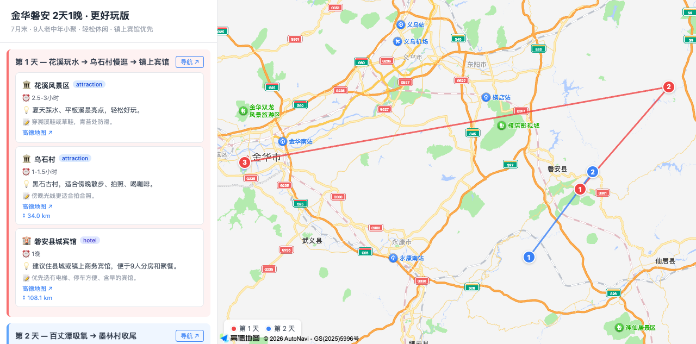
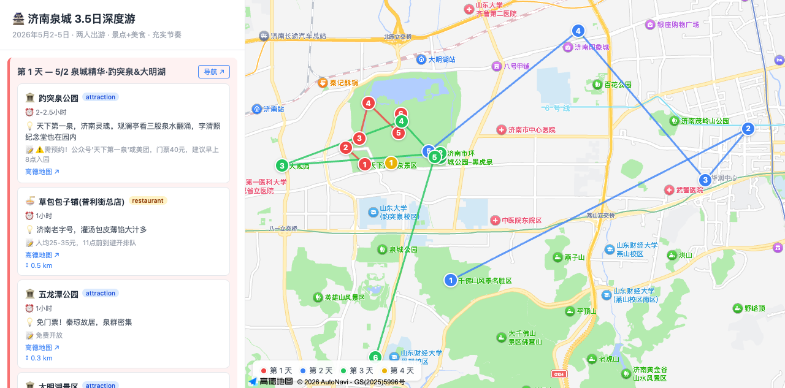
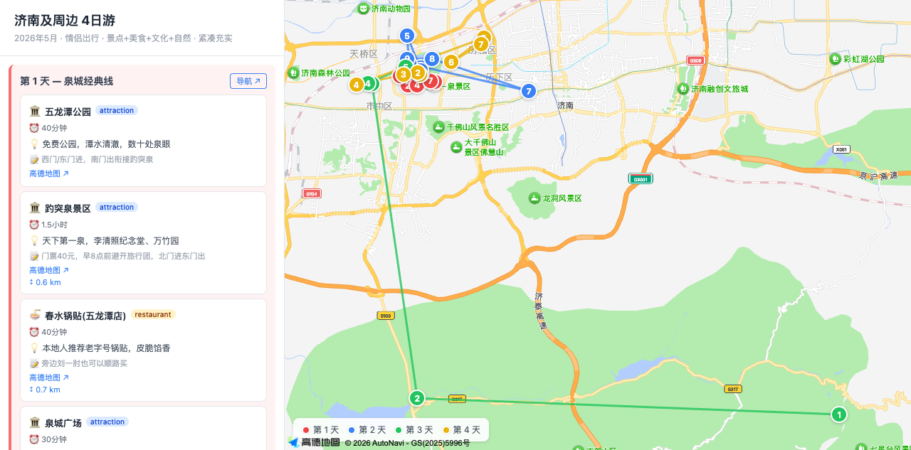

# travel-planner

Public export of the Hermes `travel-planner` skill.

This repository contains an AI travel-planning workflow that:
- collects trip requirements conversationally
- researches Xiaohongshu travel notes with `opencli`
- synthesizes day-by-day itineraries
- geocodes places with Google Maps or AMap
- generates interactive HTML itinerary pages
- publishes trip pages to GitHub Pages

Contents:
- `SKILL.md` — the exported skill definition
- `templates/` — HTML templates for Google Maps and AMap
- `assets/screenshots/` — screenshots from real deployed itinerary pages

Screenshots
- AMap / China itinerary example — 磐安 2天1晚:

  

- AMap / China itinerary example — 济南泉城 3.5日:

  

- AMap / China itinerary example — 济南及周边 4日:

  

Notes:
- Secrets are intentionally excluded. The original local skill stores API keys in `assets/.env`; that file is not published here.
- The screenshot above comes from a real deployed GitHub Pages itinerary generated by this workflow.
- I inspected the currently deployed Google Maps pages too, but they are not suitable for README screenshots right now because the public pages show a Google Maps load error / development watermark. I intentionally did not publish a misleading broken screenshot.
- This repo is meant as a portable/public version of the skill, not as a full runnable app by itself.
